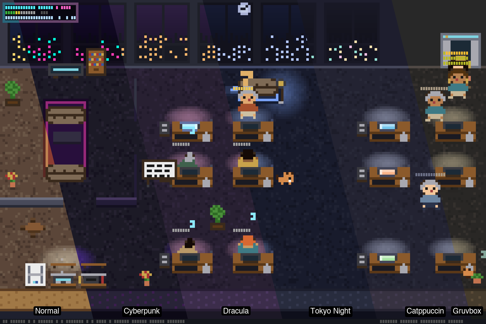

<p align="center">
  
</p>

<h1 align="center">ascii-agents</h1>

<p align="center">
  <em>Your AI coding agents, visualized as pixel-art coworkers in a terminal office.</em>
</p>

<p align="center">
  <a href="https://github.com/IvanWng97/ascii-agents/stargazers"></a>
  <a href="https://github.com/IvanWng97/ascii-agents/releases"></a>
  <a href="LICENSE"></a>
  <a href="https://github.com/IvanWng97/ascii-agents/actions/workflows/ci.yml"></a>
  <a href="https://codecov.io/gh/IvanWng97/ascii-agents"></a>
  <a href="https://claude.ai/code"></a>
  <a href="https://buymeacoffee.com/IvanWng97"></a>
</p>

<p align="center">
  
</p>

<p align="center">
  <a href="#quick-start">Quick Start</a> · <a href="#features">Features</a> · <a href="#themes">Themes</a> · <a href="#install">Install</a> · <a href="#how-it-works">How It Works</a>
</p>

---

## Why?

Running multiple AI agents in the terminal is like managing a sweatshop you can't see. They type, they wait, they finish — and you have no idea who's doing what unless you scroll through logs like a bureaucrat.

**ascii-agents** puts them all in a tiny pixel-art office you can watch from above. A little bit *Black Mirror*, a little bit *The Sims* — and somehow the most intuitive multi-agent dashboard you'll ever use.

## Features

| | Feature | Description |
|---|---|---|
| 🏢 | **Multi-agent office** | Each CC session gets a desk; overflow agents auto-fill new floors |
| 🛗 | **Multi-floor office** | PageUp/PageDown/↑↓/jk to navigate floors with slide transition |
| 🎭 | **Animated characters** | Typing, thinking (`···`), waiting (`?`), sleeping (z's), walking with A\*-routed pathfinding |
| 💡 | **Per-tool monitor glow** | Edit = blue, Bash = orange, Read = cyan — scannable at a glance |
| 🎨 | **Per-agent identity** | Deterministic shirt/hair/skin palette from session hash, 16 curated outfits |
| 🌧️ | **Weather effects** | Rain, storm, snow, fog, overcast, windy — cycles every 10 min + sunset golden hour |
| 📊 | **Tooltip stats** | Hover any agent to see session duration, tool call count, and active time % |
| 🏷️ | **Furniture tooltips** | Hover any item — desks, sofas, plants, vending machine, printer — to see its name |
| 🐱 | **Office cat** | Roams desks, pantry, sofas; sleeps near idle agents. Click to pet — pixel-art hearts float up |
| ☕ | **Coffee run** | Idle agents visit the pantry, carry a cup back to their desk. Cup stays while you work; taken on exit |
| 💬 | **Pantry chitchat** | 2+ idle agents at the same waypoint trigger speech bubbles with dev-humor snippets |
| 🪴 | **Desk personalization** | Plant (30min), photo frame (1hr) appear over time |
| 🛡️ | **Hook-safe** | The shim always exits 0 — a stuck visualizer can never block Claude Code |

## Supported Tools

| Tool | Status | Notes |
|---|---|---|
| [**Claude Code**](https://code.claude.com) | ✅ Supported | Hook shim + JSONL watcher |
| [**Antigravity CLI**](https://github.com/antiGravity-AI/antigravity-cli) | ✅ Supported | JSONL watcher |
| [**Codex CLI**](https://github.com/openai/codex) | 🔜 Planned | Same hook pattern as CC |
| [**Copilot CLI**](https://github.com/github/copilot-cli) | 🔜 Planned | Identical event names |
| [**OpenCode**](https://github.com/opencode-ai/opencode) | 🔜 Planned | Any LLM (DeepSeek / GPT / Claude / Gemini) |
| [**Cursor CLI**](https://cursor.com/cli) | 🔜 Planned | NDJSON stream |

> Adding a new tool? Implement the [`Source` trait](#contributing) — one file, one channel, done.

## Themes

Press `t` to switch themes with live preview. Your choice persists across sessions. 6 built-in:

<p align="center">
  
</p>

## Configuration

Settings are stored in `~/.config/ascii-agents/config.toml` (respects `$XDG_CONFIG_HOME`):

```toml
theme = "cyberpunk"
```

| Key | Default | Description |
|-----|---------|-------------|
| `theme` | `"normal"` | Color theme — `normal`, `cyberpunk`, `dracula`, `tokyo-night`, `catppuccin`, `gruvbox` |

CLI flags override config: `ascii-agents run --theme dracula`

## Quick Start

```bash
brew install IvanWng97/ascii-agents/ascii-agents
ascii-agents install-hooks
ascii-agents
```

In another terminal, start a Claude Code session. A character walks in from the elevator within a second.

**Keyboard shortcuts:** `q` quit · `p` pause · `t` themes · `↑↓/jk/PgUp/PgDn` floors · click to pin tooltip

<details>
<summary><strong>More install methods</strong></summary>

### Pre-built binaries

Download from [GitHub Releases](https://github.com/IvanWng97/ascii-agents/releases/latest):

| Platform | Tarball |
|---|---|
| macOS (Apple Silicon) | `ascii-agents-v*-aarch64-apple-darwin.tar.gz` |
| macOS (Intel) | `ascii-agents-v*-x86_64-apple-darwin.tar.gz` |
| Linux (x86_64, static) | `ascii-agents-v*-x86_64-unknown-linux-musl.tar.gz` |
| Linux (ARM64) | `ascii-agents-v*-aarch64-unknown-linux-gnu.tar.gz` |

### Cargo

```bash
cargo install ascii-agents
```

### From source

```bash
git clone https://github.com/IvanWng97/ascii-agents && cd ascii-agents
cargo build --release
```

</details>

## How It Works

<details>
<summary><strong>Architecture</strong></summary>

```
CC tool call ──► CC fires hook ──► ascii-agents-hook (shim)
                                         │ JSON over Unix socket
                                         ▼
                                  /tmp/ascii-agents.sock
                                         │
                       HookSocketListener ─────► ┐
                                                 │ (Transport, AgentEvent)
                       JsonlWatcher       ─────► ┤ shared mpsc channel
                                                 ▼
                       Reducer ──► SceneState (watch channel)
                                         │
                       TuiRenderer ──► draw_scene @ ~30fps
                       (pose → pixel_painter → RgbBuffer → half-block → ratatui)
```

Three Rust crates:

| Crate | Role |
|---|---|
| **ascii-agents-core** | Headless library — no terminal deps. Source trait, reducer, pose, layout, sprites. |
| **ascii-agents** | TUI binary — ratatui + crossterm + tokio. Half-block rendering + theme system. |
| **ascii-agents-hook** | Tiny shim CC invokes from hooks. 200ms timeout, always exits 0. |

</details>

## Contributing

See [`CLAUDE.md`](CLAUDE.md) for architecture and conventions. PRs welcome — especially new themes and `Source` adapters for other agent CLIs (Codex, Cursor, Gemini).

<details>
<summary><strong>Adding a new agent CLI</strong></summary>

Implement the `Source` trait and plug in via `SourceManager::with_source()`:

```rust
#[async_trait]
pub trait Source: Send + 'static {
    fn name(&self) -> &str;
    async fn run(self: Box<Self>, tx: TaggedSender) -> anyhow::Result<()>;
}
```

</details>

## Acknowledgments

Inspired by [`pixel-agents`](https://github.com/pablodelucca/pixel-agents) (VS Code), [`clawd-on-desk`](https://github.com/rullerzhou-afk/clawd-on-desk) (desktop pet), and Claude Code's [Buddy](https://dev.to/picklepixel/how-i-reverse-engineered-claude-codes-hidden-pet-system-8l7).

## Support

If you enjoy ascii-agents, consider [buying me a coffee](https://buymeacoffee.com/IvanWng97) :)

## License

[MIT](LICENSE)
